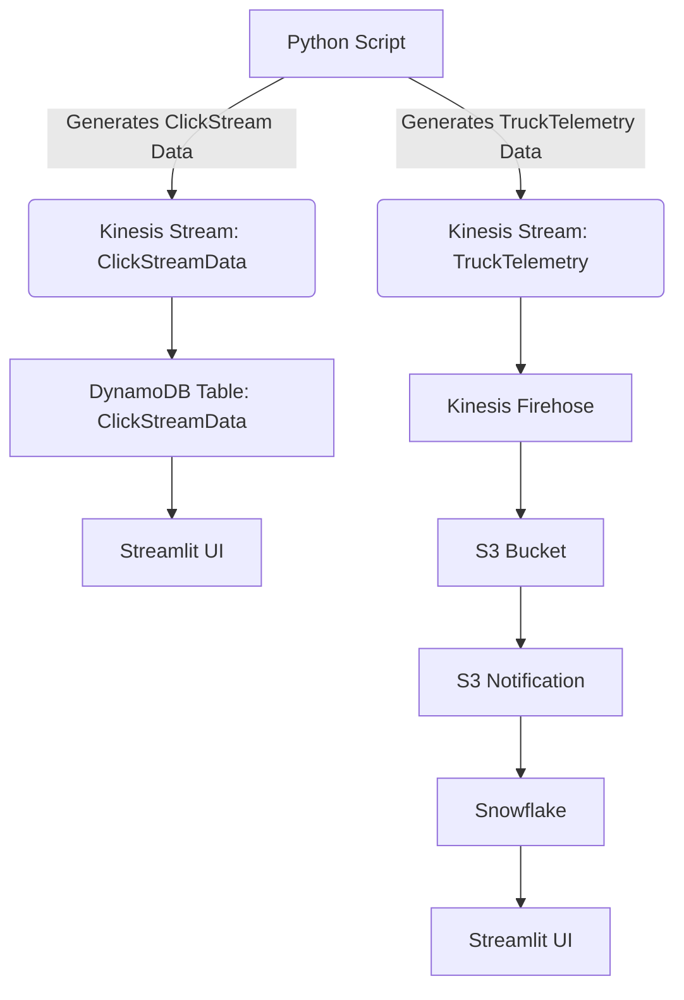

# From Clicks to Deliveries: Maximizing E-commerce Performance with Real-Time Data Integration

## Project Overview
Our goal is to enhance the performance of our e-commerce business by integrating real-time data from two critical sources:

- Customer interactions on our online platform (__clickstream data__).
- Delivery operations (__truck telemetry data__).

This integration will enable us to optimize both the customer experience and logistics efficiency, ensuring timely deliveries and data-driven decision-making.

## Project goals
- Combine online customer data with delivery truck data in real-time to improve customer satisfaction and operational efficiency.
- Enable faster and more reliable deliveries.
- Reduce fuel and maintenance costs.
- Provide real-time insights for data-driven decision-making.

##  Online Platform Optimization
__What are we doing?__
- We’re analyzing clickstream data from our website to understand how customers interact with our products.

__Why is this important?__
- By understanding what customers like and how they behave, we can:
     - Improve the user experience on our website.
     - Create better marketing strategies for popular products like mobile phones, laptops, and cameras.

__Data collected__
- __Item ID__: A unique identifier for each product.
- __Item Name__: The name of the product (e.g., mobile phone, laptop, camera).
- __Click Count__: How many times customers click on a product.

## Fleet Management and Logistics Optimization

__What are we doing?__
- We’re using IoT sensors in our delivery trucks to collect real-time data about their location, speed, and health.

__Why is this important?__
-This data helps us:
   - __Optimize delivery routes__ to save time and fuel.
   - __Reduce maintenance costs__ by identifying issues before they become serious.
   - Ensure __safe and reliable deliveries__ for our customers.

__Data collected__
- `Truck ID`: A unique identifier for each truck.
- `GPS Location`: Where the truck is (latitude, longitude, altitude) and how fast it’s moving.
- `Vehicle Speed`: The real-time speed of the truck.
- `Engine Diagnostics`: Information about the engine, such as RPM, fuel level, temperature, oil pressure, and battery voltage.
- `Odometer Reading`: The total distance the truck has traveled.
- `Fuel Consumption`: How much fuel the truck is using over time.
- `Vehicle Health and Maintenance`: Information about the brakes, tire pressure, and transmission.
- `Environmental Conditions`: Temperature, humidity, and atmospheric pressure around the truck.

# Technologies Used
This project implements a real-time data pipeline for processing __Clickstream Data__ and __Truck Telemetry Data__ using AWS services (Kinesis, Lambda, DynamoDB, S3, Firehose) and Snowflake for data storage and analysis. The data is visualized using a __Streamlit UI__.

* __AWS Services:__
     * __Kinesis Data Streams__: For real-time data ingestion.
     * __Lambda Functions__: For data processing.
     * __DynamoDB__: For storing Clickstream data
     * __S3__ : For storing Truck Telemetry data.
     * __Firehose__: For loading data from Kinesis to S3.
     * __API Gateway__: For exposing the Truck Telemetry API.
* __Snowflake__: For data warehousing and analysis.
* __Streamlit__: For data visualization.
* __Python__: For scripting and data generation.

## Workflow


### 1. __Data Generation__:
* Python scripts generate random __Clickstream Data__ (Item ID, Item Name, Click Count) and __Truck Telemetry Data__ (Truck ID, GPS Location, Engine Diagnostics, etc.).
* Data is sent to Kinesis Data Streams (`ClickDataStream` and `TruckTelemetry`).
### 2. __Data Processing__:
* Lambda Functions:
   * `KinesisToDynamoDBProcessor`: Processes Clickstream data from __Kinesis DataStream__ and stores it in __DynamoDB__ (`ClickStreamData` table).
   * `TruckDataProcessor`: Processes Truck Telemetry data from __Kinesis DataStream__ and stores it in __S3__ (`kinesis-telemetry-data-bucket/telemetry-data/`).
### 3. __Data Storage__:
* __DynamoDB__: Stores Clickstream data for real-time analysis.
* __S3__: Stores Truck Telemetry data as JSON files.
### 4. Data Ingestion into Snowflake:
* __Firehose__: Loads Truck Telemetry data from Kinesis to S3.
* __Snowpipe__: Automatically ingests data from S3 into Snowflake (`TRUCK_TELEMETRY_DATA` table) using SQS notifications.
### 5. __Data Visualization__:
* Streamlit UI:
  * Fetches Clickstream data from DynamoDB.
  * Fetches Truck Telemetry data from Snowflake.
  - Customer behavior (e.g., most-clicked products).
  - Delivery truck performance (e.g., fuel efficiency, maintenance needs)..
### 6. __Historical Data Management__:
* Snowflake table (`TRUCK_TELEMETRY_DATA`) uses __Type 2 Slowly Changing Dimensions (SCD)__ to maintain historical records of Truck Telemetry data.

## Schema for the Database

### 1. Clickstream Data (DynamoDB Table: `ClickStreamData`)

| Attribute       | Type      | Desription                   |
|-----------------|-----------|------------------------------|
| `Item_ID`         |   String  | Unique ID of the item clicked|
| `Timestamp`       |   String  | Timestamp of the click event |
| `Item_Name`       |   String  | Name of the item clicked     |
| `Click_Counts`    |   Number  | Number of clicks on the item |

### 2. Truck Telemetry Data (Snowflake Table: `TRUCK_TELEMETRY_DATA`)

The schema follows __Type 2 Slowly Changing Dimensions (SCD)__ to maintain historical data.

| Attribute                          | Type              | Description                                         |
|------------------------------------|-------------------|----------------------------------------------------|
| `TRUCK_ID`                         | STRING            | Unique ID of the truck.                            |
| `LOAD_TIMESTAMP`                   | TIMESTAMP_NTZ     | Timestamp when the data was loaded.               |
| `EFFECTIVE_START_DATE`             | TIMESTAMP_NTZ     | Start of the record's validity.                   |
| `EFFECTIVE_END_DATE`               | TIMESTAMP_NTZ     | End of the record's validity.                     |
| `IS_CURRENT`                       | BOOLEAN           | Indicates if this is the current record.          |
| `GPS_LATITUDE`                     | FLOAT             | Latitude of the truck's location.                 |
| `GPS_LONGITUDE`                    | FLOAT             | Longitude of the truck's location.                |
| `GPS_ALTITUDE`                     | FLOAT             | Altitude of the truck's location.                 |
| `GPS_SPEED`                        | FLOAT             | Speed of the truck.                               |
| `VEHICLE_SPEED`                    | FLOAT             | Speed of the vehicle.                             |
| `ENGINE_RPM`                       | FLOAT             | Engine RPM.                                       |
| `FUEL_LEVEL`                       | FLOAT             | Fuel level in the tank.                           |
| `ENGINE_TEMPERATURE`               | FLOAT             | Engine temperature.                               |
| `OIL_PRESSURE`                     | FLOAT             | Oil pressure.                                     |
| `BATTERY_VOLTAGE`                  | FLOAT             | Battery voltage.                                  |
| `ODOMETER_READING`                 | FLOAT             | Odometer reading.                                 |
| `FUEL_CONSUMPTION`                 | FLOAT             | Fuel consumption.                                 |
| `BRAKE_STATUS`                     | STRING            | Brake status.                                    |
| `TIRE_PRESSURE_FRONT_LEFT`         | FLOAT             | Front left tire pressure.                        |
| `TIRE_PRESSURE_FRONT_RIGHT`        | FLOAT             | Front right tire pressure.                       |
| `TIRE_PRESSURE_REAR_LEFT`          | FLOAT             | Rear left tire pressure.                         |
| `TIRE_PRESSURE_REAR_RIGHT`         | FLOAT             | Rear right tire pressure.                        |
| `TRANSMISSION_STATUS`              | STRING            | Transmission status.                             |
| `ENVIRONMENT_TEMPERATURE`          | FLOAT             | Environmental temperature.                        |
| `ENVIRONMENT_HUMIDITY`             | FLOAT             | Environmental humidity.                           |
| `ENVIRONMENT_PRESSURE`             | FLOAT             | Environmental pressure.                           |

## Steps to set up the Project
## PREREQUISITES
Before running the project, ensure you have the following:

### Tools and Libraries
- Python 3.x
- Streamlit
- Boto3 (AWS SDK for Python)
- Snowflake Connector for Python

### AWS Services
- AWS Kinesis
- AWS DynamoDB
- AWS S3
- AWS IAM (for permissions)

### Snowflake
- Snowflake account with a database and schema configured.

## DATA GENERATION :  Python script 
This Python script generates random __ClickStream__ and __Truck Telemetry__ data and sends it to __AWS Kinesis Data Streams__ for real-time processing. Below is a detailed explanation of the script and its functionality:

### Script Overview
1. Purpose 
  * Generates random data for two types of streams:
     * __ClickStream Data__: Simulates user interactions with e-commerce items (e.g., clicks on products).
     * __Truck Telemetry Data__: Simulates real-time telemetry data from delivery trucks.
  * Sends the generated data to AWS Kinesis Data Streams for further processing.
2. Key Components:
   * `Data Generation`: Functions to create random ClickStream and Truck Telemetry data.
   * `AWS Kinesis Integration`: Sends the generated data to Kinesis streams.
   * `Signal Handling`: Gracefully handles keyboard interrupts (e.g., Ctrl+C) to stop the script.

### Code Explanation
#### 1. Imports and AWS Kinesis Configuration
```python
import boto3
import json
import random
import time
from datetime import datetime
import signal
import sys

# AWS Kinesis Configuration
kinesis_client = boto3.client('kinesis', region_name='us-east-1')  # Replace with your region
CLICK_STREAM_NAME = 'ClickDataStream'  # Replace with your Kinesis stream name
TRUCK_STREAM_NAME = 'TruckTelemetry'   # Replace with your Kinesis stream name
```
* `boto3`: AWS SDK for Python, used to interact with AWS Kinesis.
* `kinesis_client`: Initializes a connection to AWS Kinesis in the `us-east-1` region.
* `Stream Names`: `CLICK_STREAM_NAME` and `TRUCK_STREAM_NAME` are the names of the Kinesis streams where data will be sent.
#### 2. Generate Random ClickStream Data

```python
def generate_clickstream_data():
    items = [
        {"Item_ID": "MOB001", "Timestamp": datetime.utcnow().isoformat(), "Item_Name": "Mobile Phone", "Click_Counts": random.randint(100, 500)},
        {"Item_ID": "LAP002", "Timestamp": datetime.utcnow().isoformat(),"Item_Name": "Laptop", "Click_Counts": random.randint(50, 300)},
        {"Item_ID": "CAM003", "Timestamp": datetime.utcnow().isoformat(),"Item_Name": "Camera", "Click_Counts": random.randint(30, 200)}
    ]
    return random.choice(items)
```
* items: A list of dictionaries representing e-commerce items with random click counts.
* random.choice(items): Randomly selects one item from the list to simulate user interaction.

#### 3. Generate Random Truck Telemetry Data
```python
def generate_truck_telemetry_data():
    truck_id = random.choice(["TRK001", "TRK002", "TRK003"])
    telemetry_data = {
        "TRUCK_ID": truck_id,
        "LOAD_TIMESTAMP": datetime.utcnow().isoformat(),
        "EFFECTIVE_START_DATE": datetime.utcnow().isoformat(),
        "EFFECTIVE_END_DATE": None,  # NULL for current records
        "IS_CURRENT": True,  # TRUE for current records
        "GPS_LATITUDE": round(random.uniform(30.0, 40.0), 2),
        "GPS_LONGITUDE": round(random.uniform(-120.0, -80.0), 2),
        "GPS_ALTITUDE": round(random.uniform(0.0, 100.0), 2),
        "GPS_SPEED": round(random.uniform(40.0, 70.0), 2),
        "VEHICLE_SPEED": round(random.uniform(40.0, 70.0), 2),
        "ENGINE_RPM": random.randint(2000, 3000),
        "FUEL_LEVEL": round(random.uniform(50.0, 100.0), 2),
        "ENGINE_TEMPERATURE": round(random.uniform(80.0, 100.0), 2),
        "OIL_PRESSURE": round(random.uniform(30.0, 50.0), 2),
        "BATTERY_VOLTAGE": round(random.uniform(12.0, 14.5), 2),
        "ODOMETER_READING": round(random.uniform(80000.0, 120000.0), 2),
        "FUEL_CONSUMPTION": round(random.uniform(10.0, 20.0), 2),
        "BRAKE_STATUS": random.choice(["Good", "Needs Inspection"]),
        "TIRE_PRESSURE_FRONT_LEFT": round(random.uniform(30.0, 35.0), 2),
        "TIRE_PRESSURE_FRONT_RIGHT": round(random.uniform(30.0, 35.0), 2),
        "TIRE_PRESSURE_REAR_LEFT": round(random.uniform(33.0, 37.0), 2),
        "TIRE_PRESSURE_REAR_RIGHT": round(random.uniform(33.0, 37.0), 2),
        "TRANSMISSION_STATUS": random.choice(["Operational", "Needs Maintenance"]),
        "ENVIRONMENT_TEMPERATURE": round(random.uniform(10.0, 35.0), 2),
        "ENVIRONMENT_HUMIDITY": round(random.uniform(20.0, 80.0), 2),
        "ENVIRONMENT_PRESSURE": round(random.uniform(1000.0, 1020.0), 2),
        "timestamp": datetime.utcnow().isoformat()
    }
    return telemetry_data
```
* `truck_id`: Randomly selects a truck ID from a predefined list.
* `Telemetry Data`: Simulates various truck metrics (e.g., GPS coordinates, speed, fuel level, etc.).
* `datetime.utcnow().isoformat()`: Adds a timestamp to the data.
#### 4. Signal Handling
```python
def signal_handler(sig, frame):
    print("\nKeyboard interrupt detected. Stopping the script gracefully...")
    sys.exit(0)

# Register the signal handler
signal.signal(signal.SIGINT, signal_handler)
```
* `signal_handler`: Handles keyboard interrupts (e.g., Ctrl+C) to stop the script gracefully.
* `signal.signal()`: Registers the handler for the SIGINT signal.

####  5. Send Data to Kinesis
```python
def send_to_kinesis(stream_name, data):
    response = kinesis_client.put_record(
        StreamName=stream_name,
        Data=json.dumps(data),
        PartitionKey="partition_key"
    )
    return response
```
* Kinesis is a data streaming service that works with raw text-based data (like JSON, CSV, or plain strings).It does not understand Python dictionaries directly.
* `put_record()`: The put_record() method in Kinesis only accepts strings or bytes (not Python dictionaries).By converting to JSON, we ensure Kinesis can store and forward the data correctly.
* `json.dumps(data)`: Converts the data dictionary to a JSON string.
* `PartitionKey`: A key used to distribute data across shards in the stream.

#### 6. Main Function
```python
def main():
    while True:
        try:
            # Generate and send ClickStream data
            clickstream_data = generate_clickstream_data()
            click_response = send_to_kinesis(CLICK_STREAM_NAME, clickstream_data)
            print(f"Sent ClickStream Data: {clickstream_data} | Response: {click_response}")

            # Generate and send TruckTelemetry data
            truck_data = generate_truck_telemetry_data()
            truck_response = send_to_kinesis(TRUCK_STREAM_NAME, truck_data)
            print(f"Sent TruckTelemetry Data: {truck_data} | Response: {truck_response}")

            # Wait for 15 secs before sending the next batch of data
            print("Generating and sending data...")
            time.sleep(15)
        
        except KeyboardInterrupt:
            print("\nScript stopped by user.")

if __name__ == "__main__":
    main()
```
* Infinite Loop: Continuously generates and sends data to Kinesis.
* time.sleep(15): Waits for 15 seconds before generating the next batch of data.
* Error Handling: Catches keyboard interrupts to stop the script gracefully.
### How It Works
1. Data Generation:
   * Random ClickStream and Truck Telemetry data are generated using the respective functions.
2. Data Sending:
   * The generated data is sent to the appropriate Kinesis streams using the send_to_kinesis() function.
3. Real-Time Simulation:
   * The script runs indefinitely, simulating real-time data generation and streaming.
4. Graceful Shutdown:
   * The script can be stopped using Ctrl+C, and it will exit gracefully.

## Unified Workflow Diagram

## Explanation of the Flowchart
1. __Python Script__:
   * Generates two types of data: ClickStream Data and TruckTelemetry Data.
2. __Kinesis Streams__:
   * ClickStream Data is sent to the ClickStreamData stream.
   * TruckTelemetry Data is sent to the TruckTelemetry stream.
3. __DynamoDB Table__:
    * ClickStream Data from the Kinesis stream is stored in a DynamoDB table.
4. __Streamlit UI__:
    * Fetches ClickStream Data from DynamoDB and displays it.
5. __Kinesis Firehose__:
    * TruckTelemetry Data from the Kinesis stream is sent to S3 via Firehose.
6. __S3 Bucket__:
    * Stores raw TruckTelemetry Data.
7. __S3 Notification__:
    * Triggers Snowflake to ingest data from S3.
8. __Snowflake__:
    * Stores processed TruckTelemetry Data.
9. __Streamlit UI__:
    * Fetches TruckTelemetry Data from Snowflake and displays it.
  
## 3. DATA PROCESSING : Lambda Function KinesisToDynamoDBProcessor

The Lambda function KinesisToDynamoDBProcessor plays a critical role in real-time data pipeline. Its purpose is to process Clickstream data from the Kinesis Data Stream (`ClickDataStream`) and store it in the DynamoDB table (`ClickStreamData`).
1. __Real-Time Data Processing__:
   * The function is triggered whenever new records are added to the Kinesis Data Stream (ClickDataStream).
   * It processes the incoming Clickstream data in real time.
2. __Data Transformation__:
   * The function decodes the base64-encoded data from the Kinesis stream
   * It extracts relevant fields (e.g., Item_ID, Timestamp, Item_Name, Click_Counts) from the incoming records.
3. __Data Storage__:
   * The function writes the processed Clickstream data into the DynamoDB table (ClickStreamData).
   * Each record is stored as a new item in the DynamoDB table.
4. __Scalability and Reliability__:
   * The function is designed to handle large volumes of data efficiently.
   * It ensures that data is reliably stored in DynamoDB for further analysis and reporting.

### How It Works
1. __Trigger__:
    * The function is triggered by the Kinesis Data Stream (`ClickDataStream`) whenever new records are added.
2. __Data Processing__ :
    * The function processes each record in the Kinesis stream:
       * Decodes the base64-encoded data.
       * Parses the JSON payload to extract Clickstream data.
3. __Data validation__ : The function validates the data to ensure all required fields are present.
4. __Data Storage__:
    * The function inserts the processed data into the DynamoDB table (`ClickStreamData`) using the PutItem operation.
5. __Error Handling__:
    * The function includes error handling to ensure that any issues (e.g., invalid data, DynamoDB errors) are logged and do not disrupt the pipeline.                      |

 ### KinesisToDynamoDBProcessor Lamda code
 ```python
import json
import base64
import boto3
import logging

# Configure logging
logger = logging.getLogger()
logger.setLevel(logging.INFO)

# Initialize DynamoDB resource
dynamodb = boto3.resource('dynamodb')
table = dynamodb.Table('ClickStreamData')  # Ensure this matches your table name

def lambda_handler(event, context):
    logger.info(f"Received event: {event}")
    
    for record in event['Records']:
        try:
            # Decode the base64-encoded Kinesis data
            payload = base64.b64decode(record['kinesis']['data']).decode('utf-8')
            data = json.loads(payload)
            logger.info(f"Processing record: {data}")

            # Validate the presence of required fields
            required_fields = ['Item_ID', 'Timestamp', 'Item_Name', 'Click_Counts']
            missing_fields = [field for field in required_fields if field not in data]
            if missing_fields:
                logger.error(f"Record is missing required fields: {missing_fields}. Data: {data}")
                continue  # Skip this record

            # Prepare the item for DynamoDB
            item = {
                'Timestamp': data['Timestamp'],  # Partition Key
                'Item_ID': data['Item_ID'],      # Sort Key
                'Item_Name': data['Item_Name'],
                'Click_Counts': data['Click_Counts']
            }
            logger.info(f"Prepared item for DynamoDB: {item}")

            # Insert data into DynamoDB
            table.put_item(Item=item)
            logger.info(f"Successfully inserted item: {item}")
        except Exception as e:
            logger.error(f"Error processing record: {e}")
    
    return {
        'statusCode': 200,
        'body': 'Processed {} records.'.format(len(event['Records']))
    }
```
## Code Explanation
### 1. Importing Libraries
```python
import json
import base64
import boto3
import logging
```
* `json`: Used to parse JSON data.
* `base64`: Used to decode base64-encoded data from Kinesis.
* `boto3`: AWS SDK for Python, used to interact with DynamoDB.
* `logging`: Used for logging messages (e.g., errors, debug information).

### 2. Configuring Logging
```python
logger = logging.getLogger()
logger.setLevel(logging.INFO)
```
* Sets up logging to log messages at the INFO level and above (e.g., INFO, ERROR).
  
### 3. Initializing DynamoDB Resource
```python
dynamodb = boto3.resource('dynamodb')
table = dynamodb.Table('ClickStreamData')
```
* Initializes a connection to the __DynamoDB__ service.
* Specifies the DynamoDB table (`ClickStreamData`) where the data will be stored.

### 4. Lambda Handler Function
```python
def lambda_handler(event, context):
    logger.info(f"Received event: {event}")
```
* The `lambda_handler` is the entry point for the Lambda function.
* Logs the incoming event for debugging purposes.

### 5. Processing Kinesis Records
```python
for record in event['Records']:
    try:
        # Decode the base64-encoded Kinesis data
        payload = base64.b64decode(record['kinesis']['data']).decode('utf-8')
        data = json.loads(payload)
        logger.info(f"Processing record: {data}")
```
Decoding Process:
*  Iterates through each record in the Kinesis event.
* `base64.b64decode()`: Converts the base64-encoded string back to its original binary form.
* `.decode('utf-8')`: Converts the binary data to a regular UTF-8 string (which is JSON text).
* Parsing JSON: json.loads(): Converts the JSON string back into a Python dictionary that you can work with.


### 6. Validating Required Fields
```python
required_fields = ['Item_ID', 'Timestamp', 'Item_Name', 'Click_Counts']
missing_fields = [field for field in required_fields if field not in data]
if missing_fields:
    logger.error(f"Record is missing required fields: {missing_fields}. Data: {data}")
    continue  # Skip this record
```
* Checks if the incoming data contains all required fields (Item_ID, Timestamp, Item_Name, Click_Counts).
* If any fields are missing, logs an error and skips the record.

### 7. Preparing Data for DynamoDB
```python
item = {
    'Timestamp': data['Timestamp'],  # Partition Key
    'Item_ID': data['Item_ID'],      # Sort Key
    'Item_Name': data['Item_Name'],
    'Click_Counts': data['Click_Counts']
}
logger.info(f"Prepared item for DynamoDB: {item}")
```
* Prepares the data for insertion into DynamoDB by creating a dictionary (`item`) with the required fields.
* `Timestamp` is the __Partition Key__ and `Item_ID` is the __Sort Key__ in the DynamoDB table.

### 8. Inserting Data into DynamoDB
```python
table.put_item(Item=item)
logger.info(f"Successfully inserted item: {item}")
```
* Inserts the prepared item into the DynamoDB table using the put_item method.
* Logs a success message after the item is inserted.

### 9. Error Handling
```python
except Exception as e:
    logger.error(f"Error processing record: {e}")
```
* Catches and logs any exceptions that occur during processing (e.g., decoding errors, DynamoDB errors).

### 10. Returning a Response
```python
return {
    'statusCode': 200,
    'body': 'Processed {} records.'.format(len(event['Records']))
}
```
* Returns a response indicating the number of records processed.

### Example Input and Output
__Input (Kinesis Record)__:
```json
{
  "Item_ID": "MOB001",
  "Timestamp": "2025-03-17T15:35:54.597252",
  "Item_Name": "Mobile Phone",
  "Click_Counts": 289
}
```
__Output (DynamoDB Item)__:
The function writes the following item to the DynamoDB table:

| Attribute      | Value                           |
|----------------|---------------------------------|
| Item_ID        | "MOB001"                        |
| Timestamp      | "2025-03-17T15:35:54.597252"   |
| Item_Name      | "Mobile Phone"                  |
| Click_Counts   | 289      

### Setting Up IAM Permissions for Lambda Functions - KinesisToDynamoDBProcessor :
The function requires the following IAM permissions to interact with Kinesis and DynamoDB:
* __Kinesis__: `GetRecords`, `DescribeStream`, `ListShards` for ClickDataStream.
* __DynamoDB__: `PutItem` for ClickStreamData.
    
```python
{
  "Version": "2012-10-17",
  "Statement": [
    {
      "Effect": "Allow",
      "Action": [
        "kinesis:GetRecords",
        "kinesis:DescribeStream",
        "kinesis:ListShards"
      ],
      "Resource": "arn:aws:kinesis:us-east-1:123456789012:stream/ClickDataStream"
    },
    {
      "Effect": "Allow",
      "Action": [
        "dynamodb:PutItem"
      ],
      "Resource": "arn:aws:dynamodb:us-east-1:123456789012:table/ClickStreamData"
    }
  ]
}
```
### Kinesis Trigger for Lambda Function - KinesisToDynamoDBProcessor:
* Go to the __Lambda Console__.
* Add a trigger for the `ClickDataStream` Kinesis stream.
* Set the __Batch Size__ (e.g., 100) and __Batch Window__ (e.g., 60 seconds).

## DATA PROCESSING : Lamda function TruckDataProcessor 
The `TruckDataProcessor` Lambda function is designed to:
* Process real-time Truck Telemetry data from the Kinesis Data Stream (`TruckTelemetry`).
* Store the processed data in an __S3__ bucket (`kinesis-telemetry-data-bucket/telemetry-data/`) as JSON files.
* Enable further processing of the data (e.g., loading into `Snowflake` for analysis).

### IAM Permissions for the Lambda Function TruckDataProcessor 
The function requires the following IAM permissions to interact with Kinesis and S3:
```python
{
  "Version": "2012-10-17",
  "Statement": [
    {
      "Effect": "Allow",
      "Action": [
        "kinesis:GetRecords",
        "kinesis:DescribeStream",
        "kinesis:ListShards"
      ],
      "Resource": "arn:aws:kinesis:us-east-1:123456789012:stream/TruckTelemetry"
    },
    {
      "Effect": "Allow",
      "Action": [
        "s3:PutObject"
      ],
      "Resource": "arn:aws:s3:::kinesis-telemetry-data-bucket/telemetry-data/*"
    }
  ]
}
```
## Explanation of Permissions
## Kinesis Permissions:
* `GetRecords`: To read records from the Kinesis stream.
* `DescribeStream`: To get details about the Kinesis stream.
* `ListShards`: To list shards in the Kinesis stream.
## S3 Permissions:
* `PutObject`: To upload JSON files to the S3 bucket.

## Kinesis Trigger for Lambda Function TruckDataProcessor 
The `TruckDataProcessor` function is triggered by the Kinesis Data Stream (`TruckTelemetry`). Here’s how the trigger is configured:

* Kinesis Stream: `TruckTelemetry`.
* Batch Size: Number of records to process in a single invocation (e.g., 100).
* Batch Window: Maximum time to wait before invoking the function (e.g., 60 seconds).

## How the Lambda Function TruckDataProcessor Works
__Trigger__:
The function is triggered whenever new records are added to the Kinesis Data Stream (`TruckTelemetry`).

__Data Processing__:
* The function processes each record in the Kinesis stream:
    * Decodes the base64-encoded data.
    * Parses the JSON payload to extract Truck Telemetry data.
      
__Data Storage__:
* The function generates a unique file name using a timestamp.
* Uploads the processed data as a JSON file to the S3 bucket (`kinesis-telemetry-data-bucket/telemetry-data/`).

__Error Handling__:
The function includes error handling to ensure that any issues (e.g., invalid data, S3 errors) are logged and do not disrupt the pipeline.

## Lambda TruckDataProcessor Code Explanation
### 1. Importing Libraries
```python
import json
import boto3
import base64
from datetime import datetime
```
* `json`: Used to parse JSON data.
* `boto3`: AWS SDK for Python, used to interact with S3.
* `base64`: Used to decode base64-encoded data from Kinesis.
* `datetime`: Used to generate timestamps for file names.

### 2. Initializing S3 Client
```python
s3_client = boto3.client('s3')
S3_BUCKET_NAME = 'kinesis-telemetry-data-bucket'
S3_FOLDER_NAME = 'telemetry-data/'
```
* Initializes a connection to the S3 service.
* Specifies the S3 bucket and folder where the data will be stored.

### 3. Lambda Handler Function
```python
def lambda_handler(event, context):
    try:
        # Check if 'Records' key exists in the event
        if 'Records' not in event:
            raise KeyError("'Records' key not found in the event. Ensure the event is from a Kinesis stream.")
        
        print(f"Number of records received: {len(event['Records'])}")
```
* The `lambda_handler` is the entry point for the Lambda function.
* Checks if the event contains the `Records` key (to ensure it’s from a Kinesis stream).

### 4. Processing Kinesis Records
```python
for record in event['Records']:
    # Kinesis data is base64 encoded, so decode it
    payload = base64.b64decode(record['kinesis']['data'])
    telemetry_data = json.loads(payload)
    
    # Log the decoded data for debugging
    print(f"Decoded telemetry data: {telemetry_data}")
```
* Iterates through each record in the Kinesis event.
* Decodes the base64-encoded data from Kinesis and parses it into a JSON object.

### 5. Generating a Unique File Name
```python
file_name = f"{S3_FOLDER_NAME}{datetime.now().strftime('%Y-%m-%d-%H-%M-%S-%f')}.json"
```
* Generates a unique file name using the current timestamp (e.g., telemetry-data/2025-03-17-15-35-54-597252.json).

### 6. Uploading Data to S3
```python
s3_client.put_object(
    Bucket=S3_BUCKET_NAME,
    Key=file_name,
    Body=json.dumps(telemetry_data))
    
print(f"Successfully stored telemetry data in S3: {file_name}")
```
* Uploads the processed data as a JSON file to the S3 bucket.

### 7. Error Handling
```python
except KeyError as e:
    print(f"KeyError: {str(e)}")
    return {
        'statusCode': 400,
        'body': json.dumps(f"Error: {str(e)}")
    }
except Exception as e:
    print(f"Unexpected error: {str(e)}")
    return {
        'statusCode': 500,
        'body': json.dumps(f"Error: {str(e)}")
    }
```
* Catches and logs any exceptions that occur during processing (e.g., decoding errors, S3 errors).

### 8. Returning a Response
```python
return {
    'statusCode': 200,
    'body': json.dumps('Telemetry data stored in S3 successfully!')
}
```
* Returns a response indicating success.

### Example Input and Output
#### Input (Kinesis Event):
```json
{
  "Records": [
    {
      "kinesis": {
        "data": "eyJ0cnVja19pZCI6ICJUUkswMDEiLCJnYW1lX2xvY2F0aW9uIjogeyJsYXRpdHVkZSI6IDM0LjA1MjMsImxvbmdpdHVkZSI6IC0xMTguMjU2N30sInZlaGljbGVfc3BlZWQiOiA2NS4wLCJlbmdpbmVfZGlhZ25vc3RpY3MiOiB7ImVuZ2luZV9ycG0iOiAyNTAwLCJmdWVsX2xldmVsIjogNzguNSwiZW5naW5lX3RlbXBlcmF0dXJlIjogMTg5LjN9LCJvZG9tZXRlcl9yZWFkaW5nIjogODAwMDAuMCwiZnVlbF9jb25zdW1wdGlvbiI6IDEwLjAsInZlaGljbGVfaGVhbHRoX2FuZF9tYWludGVuYW5jZSI6IHsiYnJha2Vfc3RhdHVzIjogIkdvb2QiLCJ0aXJlX3ByZXNzdXJlIjogeyJmcm9udF9sZWZ0IjogMzIuMCwiZnJvbnRfcmlnaHQiOiAzMi4wLCJyZWFyX2xlZnQiOiAzNS4wLCJyZWFyX3JpZ2h0IjogMzUuMH0sInRyYW5zbWlzc2lvbl9zdGF0dXMiOiAiT3BlcmF0aW9uYWwifSwiZW52aXJvbm1lbnRhbF9jb25kaXRpb25zIjogeyJ0ZW1wZXJhdHVyZSI6IDIyLjAsImh1bWlkaXR5IjogNTQuMCwiYXRtb3NwaGVyaWNfcHJlc3N1cmUiOiAxMDEzLjI1fSwidGltZXN0YW1wIjogIjIwMjUtMDMtMTdUMTU6MzU6NTQuNTk3MjUyIn0="
      }
    }
  ]
}
```
Decoded Data:
```json
{
  "truck_id": "TRK001",
  "gps_location": {
    "latitude": 34.0523,
    "longitude": -118.2567
  },
  "vehicle_speed": 65.0,
  "engine_diagnostics": {
    "engine_rpm": 2500,
    "fuel_level": 78.5,
    "engine_temperature": 189.3
  },
  "odometer_reading": 80000.0,
  "fuel_consumption": 10.0,
  "vehicle_health_and_maintenance": {
    "brake_status": "Good",
    "tire_pressure": {
      "front_left": 32.0,
      "front_right": 32.0,
      "rear_left": 35.0,
      "rear_right": 35.0
    },
    "transmission_status": "Operational"
  },
  "environmental_conditions": {
    "temperature": 22.0,
    "humidity": 54.0,
    "atmospheric_pressure": 1013.25
  },
  "timestamp": "2025-03-17T15:35:54.597252"
}
```
### Output (S3 File):
The function uploads the above JSON data to the S3 bucket with a unique file name, e.g., `telemetry-data/2025-03-17-15-35-54-597252.json`.

## DATA INGESTION FROM S3 INTO SNOWFLAKE
## Steps to Create an S3 Bucket and Enable Notifications
## 1. Create an S3 Bucket
   1. Go to the S3 Console:
        * Open the AWS S3 Console.
   2. Create a New Bucket:
        * Click Create bucket.
        * Enter a Bucket name (e.g., `kinesis-telemetry-data-bucket`).
        * Choose the Region (e.g., `us-east-1`).
        * Leave other settings as default (or configure as needed).
        * Click Create bucket.
## 2.  Enable Event Notifications
   1. Go to the Bucket Properties:
        * In the S3 Console, select the bucket you created (`kinesis-telemetry-data-bucket`).
        * Go to the __Properties__ tab.
   2. Enable Event Notifications:
        * Scroll down to the __Event notifications section__.
        * Click __Create event notification__.
   3. Configure Event Notification:
        * Event name: `snowflake-auto-ingest` (or any name you prefer).
        * Event types: Select `All object create events`.
        * Prefix: `telemetry-data/` (to filter events for the specific folder).
        * Send to: Choose __SQS Queue__.
        * SQS Queue: Select the SQS queue created by Snowflake (e.g., `arn:aws:sqs:us-east-1:123456789012:sf-snowpipe-queue`).
   4. Save the Configuration:
        * Click Save changes.
## 3. Verify the SQS Queue
   1. Go to the SQS Console:
        * Open the AWS SQS Console.
   2. Check the Queue:
        * Ensure the SQS queue (e.g., `sf-snowpipe-queue`) is receiving notifications from the S3 bucket.
        * Go to the __Monitoring__ tab to check metrics like __Number of Messages Sent__.
## 4. Permissions for S3 and SQS
Ensure the following permissions are configured:

__S3 Bucket Policy__
Add a bucket policy to allow Snowflake to read from the bucket:
```json
{
  "Version": "2012-10-17",
  "Statement": [
    {
      "Effect": "Allow",
      "Principal": {
        "AWS": "arn:aws:iam::123456789012:role/snowflake-role"
      },
      "Action": [
        "s3:GetObject",
        "s3:ListBucket"
      ],
      "Resource": [
        "arn:aws:s3:::kinesis-telemetry-data-bucket",
        "arn:aws:s3:::kinesis-telemetry-data-bucket/*"
      ]
    }
  ]
}
```
__SQS Queue Policy__
Add a queue policy to allow S3 to send notifications:
```json
{
  "Version": "2012-10-17",
  "Statement": [
    {
      "Effect": "Allow",
      "Principal": {
        "Service": "s3.amazonaws.com"
      },
      "Action": "SQS:SendMessage",
      "Resource": "arn:aws:sqs:us-east-1:123456789012:sf-snowpipe-queue",
      "Condition": {
        "ArnLike": {
          "aws:SourceArn": "arn:aws:s3:::kinesis-telemetry-data-bucket"
        }
      }
    }
  ]
}
```
## 5. Verify the Setup
1. Upload a Test File:
    * Upload a test JSON file to the `telemetry-data/ folder` in the S3 bucket.
    * Example file: `telemetry-data/test.json`.
2. Check SQS Queue:
    * Verify that the SQS queue receives a notification for the new file.
3. Check Snowflake:
    * Verify that the file is auto-ingested into the Snowflake table (TRUCK_TELEMETRY_DATA).

## Snowflake Setup
## 1. Create Table in Snowflake:
The table will store the Truck Telemetry data. Use the following SQL command to create the table:

```sql
CREATE OR REPLACE TABLE TRUCK_TELEMETRY_DATA (
    -- Truck Metadata
    TRUCK_ID STRING NOT NULL,
    LOAD_TIMESTAMP TIMESTAMP_NTZ DEFAULT CURRENT_TIMESTAMP(),
    EFFECTIVE_START_DATE TIMESTAMP_NTZ DEFAULT CURRENT_TIMESTAMP(),
    EFFECTIVE_END_DATE TIMESTAMP_NTZ DEFAULT NULL,
    IS_CURRENT BOOLEAN DEFAULT TRUE,

    -- GPS Location
    GPS_LATITUDE FLOAT,
    GPS_LONGITUDE FLOAT,
    GPS_ALTITUDE FLOAT,
    GPS_SPEED FLOAT,

    -- Vehicle Speed
    VEHICLE_SPEED FLOAT,

    -- Engine Diagnostics
    ENGINE_RPM FLOAT,
    FUEL_LEVEL FLOAT,
    ENGINE_TEMPERATURE FLOAT,
    OIL_PRESSURE FLOAT,
    BATTERY_VOLTAGE FLOAT,

    -- Odometer Reading
    ODOMETER_READING FLOAT,

    -- Fuel Consumption
    FUEL_CONSUMPTION FLOAT,

    -- Vehicle Health and Maintenance
    BRAKE_STATUS STRING,
    TIRE_PRESSURE_FRONT_LEFT FLOAT,
    TIRE_PRESSURE_FRONT_RIGHT FLOAT,
    TIRE_PRESSURE_REAR_LEFT FLOAT,
    TIRE_PRESSURE_REAR_RIGHT FLOAT,
    TRANSMISSION_STATUS STRING,

    -- Environmental Conditions
    ENVIRONMENT_TEMPERATURE FLOAT,
    ENVIRONMENT_HUMIDITY FLOAT,
    ENVIRONMENT_PRESSURE FLOAT
);
```

## 2. Create an External Stage in Snowflake
An external stage points to the S3 bucket where the Truck Telemetry data is stored. Use the following SQL command to create the stage:
```sql
-- Create an external stage pointing to the S3 bucket
CREATE OR REPLACE STAGE truck_telemetry_stage
  URL = 's3://kinesis-telemetry-data-bucket/telemetry-data/'
  CREDENTIALS = (
    AWS_KEY_ID = 'your-aws-access-key-id'
    AWS_SECRET_KEY = 'your-aws-secret-access-key'
  )
  FILE_FORMAT = (TYPE = 'JSON');
```
Parameters:
* URL: The S3 bucket and folder path (e.g., `s3://kinesis-telemetry-data-bucket/telemetry-data/`).
* CREDENTIALS: AWS access key and secret key for accessing the S3 bucket.
* FILE_FORMAT: Specifies the file format (e.g., JSON).

## 3. Create a Pipe in Snowflake
A pipe automates the process of loading data from the external stage into the Snowflake table. Use the following SQL command to create the pipe:

```sql
-- Create a pipe to auto-ingest data from S3 into Snowflake
CREATE OR REPLACE PIPE truck_telemetry_pipe
  AUTO_INGEST = TRUE
  AS
  COPY INTO TRUCK_TELEMETRY_DATA
  FROM @truck_telemetry_stage
  FILE_FORMAT = (TYPE = 'JSON');
```
Parameters:
* AUTO_INGEST: Enables automatic ingestion of data from S3 using SQS notifications.
* COPY INTO: Specifies the target table (`TRUCK_TELEMETRY_DATA`) and the source stage (`@truck_telemetry_stage`).
  
## 4. Snowflake ARN:
The Snowflake ARN is required to configure the SQS queue for auto-ingest. Follow these steps to get the ARN:
1. Run the Following Query in Snowflake:
```sql
DESC PIPE truck_telemetry_pipe;
```
2. Find the notification_channel Field:
* The notification_channel field contains the ARN of the SQS queue created by Snowflake.
* Example `ARN: arn:aws:sqs:us-east-1:123456789012:sf-snowpipe-queue`

3. Use the ARN in S3 Event Notifications:
* When enabling event notifications in the S3 bucket, specify this ARN as the SQS queue.

## 5. Verify the Setup
1. Upload a Test File:
   * Upload a test JSON file to the telemetry-data/ folder in the S3 bucket.
   * Example file: telemetry-data/test.json.
2. Check Snowpipe Status:
   * Run the following query to check the status of the pipe:
```sql
SELECT SYSTEM$PIPE_STATUS('truck_telemetry_pipe');
```
3. Check the Snowflake Table:
   * Run the following query to verify that the data is loaded into the table:
```sql
SELECT * FROM TRUCK_TELEMETRY_DATA LIMIT 10;
```

## DATA VISUALIZATION - Streamlit UI
This Streamlit UI code is designed to integrate real-time data from __AWS DynamoDB__ (for clickstream data) and __Snowflake__ (for truck telemetry data) to provide insights into e-commerce performance. Below is a detailed explanation of the code and its functionality:

### Code Explanation
#### 1. Imports and Configuration
```python
import streamlit as st
import boto3
from snowflake.connector import connect
import pandas as pd
```
* Streamlit: Used to create the web-based UI.
* Boto3: AWS SDK for Python, used to interact with AWS DynamoDB.
* Snowflake Connector: Used to connect to Snowflake and fetch data.
* Pandas: Used for data manipulation and visualization.

#### 2. AWS DynamoDB Configuration
```python
dynamodb = boto3.resource('dynamodb', region_name='us-east-1')
clickstream_table = dynamodb.Table('ClickStreamData')  # Replace with your DynamoDB table name
```
* `boto3.resource`: Initializes a connection to DynamoDB in the `us-east-1` region.
* `clickstream_table`: Points to the DynamoDB table (`ClickStreamData`) where clickstream data is stored.
#### 3. Snowflake Configuration
```python
snowflake_config = {
    'user': 'user',
    'password': 'password',
    'account': 'accout',
    'warehouse': 'TRUCK_TELEMETRY_WH',
    'database': 'ECOMMERCE_DATA',
    'schema': 'TRUCK_TELEMETRY'
}
```
* Snowflake Connection Details: Includes user credentials, account details, warehouse, database, and schema to connect to Snowflake.

#### 4. Fetching Clickstream Data from DynamoDB
```python
def fetch_clickstream_data():
    response = clickstream_table.scan()
    return response['Items']
```
* `scan()`: Retrieves all items from the DynamoDB table.
* `response['Items']`: Returns the fetched data as a list of dictionaries.
           
#### 5. Fetching Truck Telemetry Data from Snowflake
```python
def fetch_truck_telemetry_data():
    conn = connect(**snowflake_config)
    cursor = conn.cursor()
    query = """
    SELECT * FROM truck_telemetry_data where IS_CURRENT=TRUE
    """
    cursor.execute(query)
    result = cursor.fetchall()
    columns = [desc[0] for desc in cursor.description]
    cursor.close()
    conn.close()
    return pd.DataFrame(result, columns=columns)
```
* `connect()`: Establishes a connection to Snowflake using the provided configuration.
* `cursor.execute(query)`: Executes a SQL query to fetch current truck telemetry data (IS_CURRENT=TRUE).
* `pd.DataFrame`: Converts the query result into a Pandas DataFrame for easier manipulation and visualization.

#### 6. Streamlit UI
```python
st.title("From Clicks to Deliveries: Real-Time E-Commerce Data Dashboard")
```
* Title: Sets the title of the Streamlit app.

#### 7. Sidebar Navigation
```python
page = st.sidebar.selectbox("Choose a page", ["Clickstream Data", "Truck Telemetry Data"])
```
* Sidebar: Provides a dropdown menu to navigate between two pages:
     * Clickstream Data: Displays and visualizes clickstream data from DynamoDB.
     * Truck Telemetry Data: Displays and visualizes truck telemetry data from Snowflake.

#### 8. Clickstream Data Page
```python
if page == "Clickstream Data":
    st.header("Clickstream Data Analysis")
    st.write("### Real-Time Clickstream Data from DynamoDB")
    
    # Fetch and display clickstream data
    clickstream_data = fetch_clickstream_data()
    if clickstream_data:
        df = pd.DataFrame(clickstream_data)
        st.table(df)
        
        # Visualize clickstream data
        st.write("### Clickstream Data Visualization")
        st.bar_chart(df.set_index('Item_Name')['Click_Counts'])
    else:
        st.error("No clickstream data found.")
```
* `st.table(df)`: Displays the clickstream data in a table format.
* `st.bar_chart()`: Visualizes the click counts for each item using a bar chart.
* `Error Handling`: Displays an error message if no data is found.

#### 9. Truck Telemetry Data Page
```python
elif page == "Truck Telemetry Data":
    st.header("Truck Telemetry Data Analysis")
    st.write("### Real-Time Truck Telemetry Data from Snowflake")
    
    # Fetch and display truck telemetry data
    truck_data = fetch_truck_telemetry_data()
    if not truck_data.empty:
        st.write("#### Current Truck Telemetry Data")
        st.dataframe(truck_data)
        
        # Visualize truck speed
        st.write("### Truck Speed Visualization")
        st.line_chart(truck_data.set_index('TRUCK_ID')['VEHICLE_SPEED'])
    else:
        st.error("No truck telemetry data found.")
```
* `st.dataframe(truck_data)`: Displays the truck telemetry data in an interactive table.
* `st.line_chart()`: Visualizes the speed of each truck using a line chart.
* Error Handling: Displays an error message if no data is found.

#### How It Works
1. __User Interaction__:
* The user selects a page from the sidebar to view either clickstream data or truck telemetry data.
2. __Data Fetching__:
* For __Clickstream Data__: The app fetches data from DynamoDB and displays it in a table and bar chart.
* For __Truck Telemetry Data__: The app fetches data from Snowflake and displays it in a table and line chart.
3. __Real-Time Updates__:
* The app dynamically updates the displayed data and visualizations whenever the underlying data changes.

## Project Benefits

### 1. Real-Time Insights
- Provides real-time visibility into **e-commerce performance** (clickstream data) and **delivery operations** (truck telemetry data).
- Enables quick decision-making based on up-to-date information.

### 2. Scalability
- Built on **AWS Kinesis** and **Snowflake**, which are highly scalable and can handle large volumes of data.
- Suitable for small to large e-commerce businesses.

### 3. Cost-Effective
- Uses serverless AWS services (e.g., Kinesis, DynamoDB) and Snowflake's pay-as-you-go model, reducing infrastructure costs.

### 4. Improved Customer Experience
- Tracks user interactions (clickstream data) to identify trends and improve product offerings.
- Monitors delivery operations (truck telemetry) to ensure timely and efficient deliveries.

### 5. Easy Visualization
- The **Streamlit UI** provides an intuitive and interactive way to visualize data, making it accessible to non-technical users.

### 6. Integration Flexibility
- Easily integrates with other AWS services (e.g., S3, Lambda) and third-party tools like Snowflake.

## Challenges Faced

### 1. Real-Time Data Ingestion
- **Challenge**: Ensuring low-latency data ingestion from multiple sources (clickstream and truck telemetry).
- **Solution**: Used **AWS Kinesis** for real-time data streaming and optimized the Python script for efficient data generation.

### 2. Data Consistency
- **Challenge**: Maintaining data consistency across DynamoDB and Snowflake.
- **Solution**: Implemented proper error handling and retry mechanisms in the Python script and Kinesis Firehose.

### 3. Snowflake Integration
- **Challenge**: Setting up Snowflake to ingest data from S3 and ensuring proper schema mapping.
- **Solution**: Used Snowflake's **COPY INTO** command and configured S3 notifications to trigger data ingestion.

### 4. Streamlit UI Performance
- **Challenge**: Fetching and displaying large datasets from DynamoDB and Snowflake in real-time.
- **Solution**: Optimized queries and used pagination to load data incrementally in the Streamlit UI.

### 5. AWS Permissions
- **Challenge**: Managing IAM roles and permissions for Kinesis, DynamoDB, and S3.
- **Solution**: Created a detailed IAM policy with the minimum required permissions and tested it thoroughly.

### 6. Testing and Validation
- **Challenge**: Simulating real-world scenarios for testing clickstream and truck telemetry data.
- **Solution**: Used randomized data generation in the Python script and validated outputs at each stage (Kinesis, DynamoDB, S3, Snowflake).

